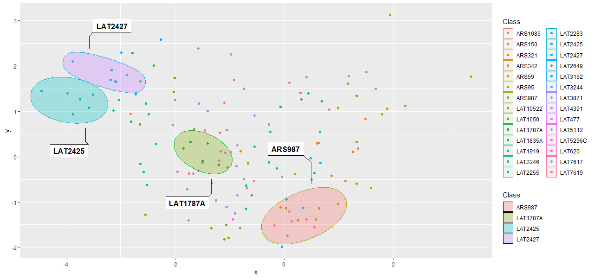

# Script Classification and Writer Identification
# Two Tasks for a Common Understanding of Cultural Heritage

Writer identification and Script classification are usually considered as two separated and very different tasks, as well in palaeography as in computer science. Following the ICDAR competition on the CLAMM  corpus  about  script  classification  and  dating,  this  contribution  proposes  to  reconsider  the  tasks  and  methods  of  Palaeography  and Computer  Vision applied  for  Artificial  Paleography.  We  argue  that,  while  aiming  at  understanding  past  societies  and  the  written  cultural  heritage  in  its  whole  complexity,  palaeography  and  its  core  tasks  may  be  defined  as  discretizing  the  historical  and  social  continuum  at  different levels of granularity. In this sense, we can consider Writer identification and Script classification as  one  single  task.  We  then  transfer  this  hypothesis  to  computer  science,  by  running  two  infrastructures created for Script classification on a more homogeneous dataset with a focus on Writer Identification. The analysis of the results confirms the unicity of the tasks and let us consider in a novel way how to evidence and illustrate the historical continuum, while discretizing it in a non-binary way

If you use the present repository, its data and figures, please consult and cite:
Stutzmann, Dominique, Christopher Tensmeyer, and Vincent Christlein. « Writer Identification and Script Classification: Two Tasks for a Common Understanding of Cultural Heritage ». *manuscript cultures*, 15 (2020): 11-24. 
[https://www.csmc.uni-hamburg.de/publications/mc/files/articles/mc15-02-stutzmann.pdf](https://www.csmc.uni-hamburg.de/publications/mc/files/articles/mc15-02-stutzmann.pdf)

This publication also explains how and on which data sets the matrices were produced. 

```
@article{stutzmann_writer_2020,
	title = {Writer {Identification} and {Script} {Classification}: {Two} {Tasks} for a {Common} {Understanding} of {Cultural} {Heritage}},
	volume = {15},
	issn = {1867{\textendash}9617},
	url = {https://www.csmc.uni-hamburg.de/publications/mc/files/articles/mc15-02-stutzmann.pdf},
	abstract = {Writer identification and Script classification are usually considered as two separated and very different tasks, as well in palaeography as in computer science. Following the ICDAR competition on the CLAMM  corpus  about  script  classification  and  dating,  this  contribution  proposes  to  reconsider  the  tasks  and  methods  of  Palaeography  and Computer  Vision applied  for  Artificial  Paleography.  We  argue  that,  while  aiming  at  understanding  past  societies  and  the  written  cultural  heritage  in  its  whole  complexity,  palaeography  and  its  core  tasks  may  be  defined  as  discretizing  the  historical  and  social  continuum  at  different levels of granularity. In this sense, we can consider Writer identification and Script classification as  one  single  task.  We  then  transfer  this  hypothesis  to  computer  science,  by  running  two  infrastructures 
	created for Script classification on a more homogeneous dataset with a focus on Writer Identification. The analysis of the results confirms the unicity of the tasks and let us consider in a novel way how to evidence and illustrate the historical continuum, while discretizing it in a non-binary way},
	urldate = {2018-08-21},
	journal = {manuscript cultures},
	author = {Stutzmann, Dominique and Tensmeyer, Christopher and Christlein, Vincent},
	year = {2020},
	pages = {11--24},
	}

```
## Contents
The present repository contains the following documents and folders:
```

└/root/
│   │   readme.md
│   │   Explorer3D
│   │   ScriptClass
│   │   Visualizations
│   │   WriterIdentification

```

Both folders /ScriptClass/ and /WriterIdentification/ contain the raw distance and belonging matrices produced by Vincent Christlein and Chris Tensmeyer for the above mentioned article. 
The /ScriptClass/ matrices are based on the 2000 images provided in the ICDAR2017 Competition on the Classification of Medieval Handwritings in Latin Script. The 2000 images are available at 
[https://clamm.irht.cnrs.fr/icdar-2017/icdar2017-clamm/](https://clamm.irht.cnrs.fr/icdar-2017/icdar2017-clamm/ "https://clamm.irht.cnrs.fr/icdar-2017/icdar2017-clamm/"). The matrices are 
the base for the competition and publication : 
```

@inproceedings{cloppet_icdar_2017,
	address = {Kyoto},
	title = {{ICDAR} 2017 {Competition} on the {Classification} of {Medieval} {Handwritings} in {Latin} {Script}},
	doi = {DOI 10.1109/ICDAR.2017.224},
	abstract = {The ICDAR 2017 Competition on Historical Document
Writer Identification is dedicated to record the most
recent advances made in the field of writer identification. The
goal of the writer identification task is the retrieval of pages,
which have been written by the same author. The test dataset
used in this competition consists of 3600 handwritten pages
originating from 13th to 20th century. It contains manuscripts
from 720 different writers where each writer contributed five
pages. This paper describes the dataset, as well as the details of
the competition. Five different institutions submitted six methods which were ranked using identification and retrieval metrics. The
paper describes the competition details including the dataset, the
evaluation measures used as well as a short description of each
submitted method.},
	booktitle = {14th {IAPR} {International} {Conference} on {Document} {Analysis} and {Recognition}. {ICDAR} 2017},
	publisher = {CPS},
	author = {Cloppet, Florence and Eglin, Véronique and Helias-Baron, Marlène and Kieu, Van Cuong and Stutzmann, Dominique and Vincent, Nicole},
	year = {2017},
	note = {00000},
	pages = {1371--1376},
}

```

The \WriterIdentification\ is an *ad hoc* corpus, studied in:
```

@phdthesis{stutzmann_ecrire_2009,
	address = {Paris},
	title = {Écrire à {Fontenay}. {Esprit} cistercien et pratiques de l’écrit en {Bourgogne} ({XIIe}-{XIIIe} siècles)},
	shorttitle = {Écrire à {Fontenay}},
	language = {fre},
	school = {Université Paris 1 Panthéon-Sorbonne, Histoire},
	author = {Stutzmann, Dominique},
	year = {2009},
	note = {doctorat; thèse de doctorat},
}

``` 

The \Explorer3D\ folder contains the same matrices formatted for the use in the Explorer3D software, that was used for the original publication.

The ([Explorer3D software](https://www.univ-orleans.fr/lifo/software/Explorer3D/)) creates three-dimensional graphs that capture more information than flat 2D PCAs. 
Since R is used by more users and does not require to reformat the original CSV files, the .Rhistory file and furthuer visualizations were created for the workshop "La paléographie à l’heure de l’intelligence artificielle / Artificial Intelligence and palaeography". The data is the same as the one used in the aforementioned paper, but processed with R and with an additional Rtsne visualisation, including Plotly interactive HTML pages.
The /Explorer3D/ folder provides all required files to re-create the plates of the original article.

## Additional vizualisations

After the original article, we have created new visualizations, either PNG format or in interactive in HTML format. The code to generate those in R software is provided in the \Visualizations\ folder.

")

")


 with Explorer3D")

## .R code to produce the figures above

```
#install packages and load

install.packages(c("FactoMineR", "factoextra")) 
library(FactoMineR)
library(factoextra)

########
# DATA #
########

#load data files (not all of them are used below, please select if you want to change)
ChrB <- read.csv("Script-Classification-Writer-Identification/ScriptClass/Icdar2017_Christlein_belonging.csv", header = TRUE, sep=";") 
ChrB <- read.csv("ScriptClass/Icdar2017_Christlein_belonging.csv", header = TRUE, sep=";")
ChrB <- read.csv("ScriptClass/Icdar2017_Christlein_belonging.csv", header = TRUE, sep=";")
ChrD <- read.csv("ScriptClass/Icdar2017_Christlein_distance.csv", header = TRUE, sep=";")
TenB <- read.csv("ScriptClass/Icdar2017_Tensmeyer_belonging.csv", header = TRUE, sep=";")
TenD <- read.csv("ScriptClass/Icdar2017_Tensmeyer_distance.csv", header = TRUE, sep=";")
GT <- read.csv("ScriptClass/Ground-Truth.csv", header = TRUE, sep=";")

#checking the size and type of data
dim(ChrB)
head(ChrB)
dim(TenB)
head(TenB)
dim(ChrD)
head(ChrD)
dim(TenD)
head(TenD)

#formating the imported tables and adding metadata
rownames(ChrB) <- ChrB$FILENAME
rownames(TenB) <- ChrB$FILENAME
ChrB$Script_type_ICDAR2017 <- factor(ChrB$Script_type_ICDAR2017, levels = c("1_Caroline", "2_Cursiva", "3_Half_Uncial", "4_Humanistic", "5_Humanistic_Cursive", "6_Hybrida", "7_Praegothica", "8_Semihybrida", "9_Semitextualis", "10_Textualis_meridionalis", "11_Textualis", "12_Uncial"))
TenB$Script_type_ICDAR2017 <- factor(TenB$Script_type_ICDAR2017, levels = c("1_Caroline", "2_Cursiva", "3_Half_Uncial", "4_Humanistic", "5_Humanistic_Cursive", "6_Hybrida", "7_Praegothica", "8_Semihybrida", "9_Semitextualis", "10_Textualis_meridionalis", "11_Textualis", "12_Uncial"))

#################################
# Principal COMPONENT ANALYSIS #
################################

#Principal Component Analysis and visualizations on axes 1-2 and 1-3
ChrB.pca <- PCA(ChrB, quali.sup=1:6, ncp=3, scale.unit=TRUE, graph=TRUE)
ChrB.pca.viz <- fviz_pca_ind(ChrB.pca, axes = c(1, 2), geom="point", col.ind=ChrB$Script_type_ICDAR2017) + geom_point(aes(col=ChrB$Script_type_ICDAR2017, shape=ChrB$Script_type_ICDAR2017)) + scale_shape_manual(values=c(1, 2, 3, 4, 5, 6, 7, 8, 9, 10, 11, 12))
ChrB.pca.viz 
ChrB.pca.viz.13 <- fviz_pca_ind(ChrB.pca, axes = c(1, 3), geom="point", col.ind=ChrB$Script_type_ICDAR2017) + geom_point(aes(col=ChrB$Script_type_ICDAR2017, shape=ChrB$Script_type_ICDAR2017)) + labs(col = "Script type", shape = "Script type") + scale_shape_manual(values=c(1, 2, 3, 4, 5, 6, 7, 8, 9, 10, 11, 12))
ChrB.pca.viz.13

#Create a more user friendly graph and saving it
install.packages("plotly")
library(htmlwidgets)
library(plotly)
ChrB.pca.plotly <- ggplotly(ChrB.pca.viz)
saveWidget(ChrB.pca.plotly, "Icdar2017_Christlein_belonging_plotly_pca.html")

#########
# RTSNE #
#########

#RTSNE and associated graphs
library(Rtsne)
set.seed(4000)
ChrB.rtsne <- Rtsne(ChrB[,6:18], theta=0.0, pca_scale = TRUE)
ChrB.rtsne.frame <- data.frame(x = ChrB.rtsne$Y[,1], y = ChrB.rtsne$Y[,2])
rownames(ChrB.rtsne.frame) <- rownames(ChrB)
ChrB.rtsne.frame <- cbind(ChrB.rtsne.frame, ChrB$Script_type_ICDAR2017)
colnames(ChrB.rtsne.frame) <- c("x", "y", "Script_type")
ChrB.rtsne.plot <- ggplot(ChrB.rtsne.frame, aes(x=x, y=y)) + geom_point(aes(col=ChrB$Script_type_ICDAR2017, shape=ChrB$Script_type_ICDAR2017)) + labs(col = "Script type", shape = "Script type") + scale_shape_manual(values=c(1, 2, 3, 4, 5, 6, 7, 8, 9, 10, 11, 12))
ChrB.rtsne.plot 
ChrB.rtsne.plotly <- ggplotly(ChrB.rtsne.plot)
saveWidget(ChrB.rtsne.plotly, "Icdar2017_Christlein_belonging_plotly_rtnse.html")

#########################################################################
# APPLYING THE SAME ANALYSIS TO THE WRITTEN PRODUCTION OF A SCRIPTORIUM #
#########################################################################

# Loading Christlein's belonging matrix
FB <- read.csv("WriterFontenay/Writer_Christlein_belonging.csv", header = TRUE, sep=";")
rownames(FB) <- FB$Orig_ImgFileName

# PCA
FB.pca <- PCA(FB, quali.sup=1:11, ncp=3, scale.unit=TRUE, graph=TRUE)

# reducing PCA to the coordinates of axes 1-2 to use the plot functions and ggforce package rather than fviz from factoextra
FBxy <- data.frame(FB.pca$ind$coord[,1:2])
FBxy <- cbind(FBxy, FB$Class, FB$Orig_ImgFileName)
colnames(FBxy) <- c("x", "y", "Class", "OrigFileName")

# producing plots
g <- ggplot(FBxy, aes(x=x, y=y, col=Class)) + geom_point()
g
h <- ggplot(subset(FBxy, startsWith(as.character(Class), "ARS") | startsWith(as.character(Class), "LAT")), aes(x=x, y=y, col=Class)) + geom_point()
h
install.packages("ggforce")
library(ggforce)
i <- h + geom_mark_ellipse(aes(fill = Class, label = Class, filter = (Class == 'ARS987' | Class == 'LAT1787A'  | Class == 'LAT2427'  | Class == 'LAT2425')))
i

```
